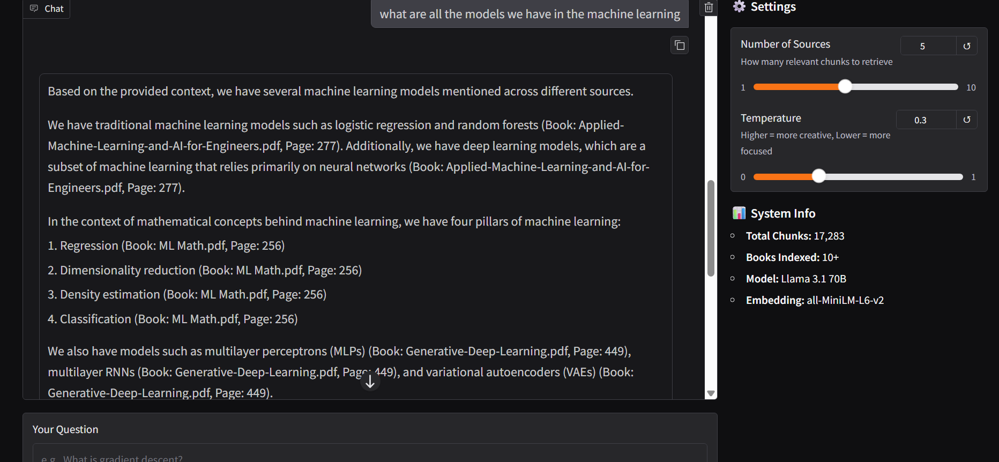

# Building RAG System That Answers about AI/ML and CSE related 
its a RAG system built on AI/ML and Computer Science related books and concepts to query and learn it more efficiently.
<!-- Initialize UV package -->
``` uv init
uv venv ```

<!-- Activate the Virtual Environment -->
```.venv\Scripts\activate```

<!-- Install Core Libraries -->
```
uv add pypdf2 langchain langchain-community chromadb sentence-transformers google-generativeai python-dotenv

```

## What each library does:

- pypdf2: Reads PDF files
- langchain: Framework for building RAG systems (makes our life easier)
- langchain-community: Community integrations (ChromaDB connector)
- chromadb: Vector database (stores embeddings)
- sentence-transformers: Creates embeddings locally
- google-generativeai: Google Gemini API client
- python-dotenv: Manages API keys securely


<!-- Lets Code the Load Files -->
## I've added series of books of AI and ML along with some Computer science concepts that enriches the comprehensiveness in the domain.

<!-- Methods -->
- import Library (PyPDF2)

- open the file with path 

- get the Num of books(filename) and num_page in each filename

- extract text from  it

- Save it into a new folder as json file that contains the extracted text with "FileName", "PageNumber", "Text"

<!-- Chunk the Text  -->
# Now Chunk the text we have extracted from the data folder.

"""
chunk_text.py

Purpose: Load extracted PDF pages and chunk them into smaller pieces for RAG.

Input: data/extracted_pages.json (from load_pdfs.py)
Output: data/chunked_data.json

Chunking Strategy:
- Chunk size: 800 characters (optimal for retrieval)
- Overlap: 200 characters (preserves context at boundaries)
- Uses RecursiveCharacterTextSplitter (splits at natural boundaries)

Why chunking?
1. LLMs have token limits - can't process entire books
2. Smaller chunks = more precise retrieval
3. Better similarity matching in vector search
"""

<!-- Store the Chunked Texts into Vector DB -->
Now that we've chunked the texts from the loaded documents (PDFs), now we need to store them into an embedding system which is later used to match the user queries (semantic search) with the vectors using similar chunks.  

#### What is Embedding?  
A list of numbers (vector) that represents the meaning of text  
Similar meanings → similar numbers  
```
"neural network" → [0.2, 0.8, 0.1, 0.5, ...]  (384 numbers)
"deep learning"  → [0.3, 0.7, 0.2, 0.4, ...]  (similar!)
"pizza recipe"   → [0.9, 0.1, 0.8, 0.2, ...]  (very different!)
```
<!-- What we use -->
Transformers → sentence-transformer (Model → all-MiniLM-L6-v2)  
ChromaDB → Vector Database  

#### How do we find similar chunks?

Cosine similarity: Measures angle between vectors
Smaller angle = more similar meaning

```
create_vectordb.py

Purpose: Convert text chunks into embeddings and store them in ChromaDB.

Input: data/chunked_data.json (from chunk_text.py)
Output: data/chroma_db/ (ChromaDB persistent storage)

Embedding Model: all-MiniLM-L6-v2 (384 dimensions, local)
Vector DB: ChromaDB (local, persistent)

What are embeddings?
- Mathematical representations of text meaning
- Similar text = similar vectors
- Enables semantic search (meaning-based, not keyword-based)
```

<!-- Process -->
- Get the I/p and o/p path
- Initialize the Batch_size (in 100 terms)
- open it and read i/p files then store it into a new variables

- initialize the embedding 
- use sentence-transformer model and use embedding function 

- Create ChromaDB connection
<!-- generate embedding and connect to DB -->
- connect it with i/p data

- test the connection and embedding

#### This gives the similar chunks and context which has smaller cosin value (means - similar) to the question/query asked which is raw.

Query → embedding
Find similar chunks
Return raw text snippets

❓ Question: "What is machine learning?"
🔍 Search: Finds relevant chunks
📄 Returns: Raw snippets

<!-- Now Its time to introduce brain to it -->
## Akal lana zaruri hai..............
```
query_system.py

Purpose: Query the RAG system and get intelligent answers with citations.

How it works:
1. Take user question
2. Convert to embedding
3. Search ChromaDB for similar chunks
4. Send chunks + question to Gorg
5. Get intelligent answer with citations
```
### here is the result of the Rag system built



# what i have learnt from this is
What You've Learned (HUGE!)

✅ PDF Processing - Handling real-world PDFs with errors
✅ Text Chunking - Strategic splitting for RAG
✅ Embeddings - Converting text to semantic vectors
✅ Vector Databases - ChromaDB for similarity search
✅ LLM Integration - Prompt engineering for RAG
✅ Error Handling - Dealing with encoding issues, surrogates, etc.
✅ Software Engineering - Modular code, separate concerns